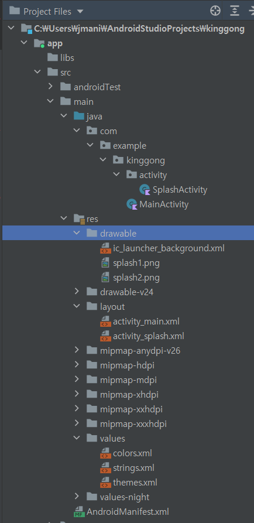

# kinggong

### Create workspace
```
cd <your workspace path>
git clone https://github.com/jmani0223/kinggong.git
cd kinggong
```

### Easy commit
``` shell
git push origin
git add .
git commit -m "<code annotation>"
git push origin
```

### Developing

please follow Camel or Pascal Case 
[reference](https://lcw126.tistory.com/260)

### Guide

{: width="100" height="100"}

+ kinggong.activity
  + create kotlin file
  + kinggong.activity.000Activity.kt
+ drawable
  - photo, etc
+ layout
  - screen layout
+ values
  + colors, strings, themes config files
+ AndroidMainifest.xml
  + Link all activity files in here
